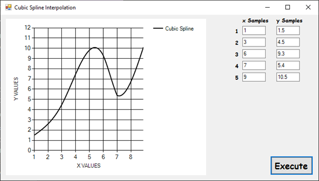

**Cubic Spline Interpolation**

**Overview**

Cubic spline interpolation is a method used to construct new data points within the range of a discrete set of known data points. It generates a series of cubic polynomials that span the segments between each pair of adjacent knots (data points). This method ensures that the slopes are continuous at each node and reduces the tendency to oscillate between points, unlike higher-order polynomials.

**C\# Console Application**

A C\# console application is provided to perform cubic spline interpolation. To use the application:

1.  Enter your x and y values in the "x Samples" and "y Samples" columns, respectively. Ensure the x values are in increasing order.
2.  Execute the program to obtain the interpolated values.

The program solves the linear equations using the inverse matrix method to find the k values for the cubic splines.

**Example**

Here is an example of how to use the C\# application for cubic spline interpolation:

1.  Input the sample data points:
    -   x Samples: 1, 3, 6, 7, 9
    -   y Samples: 1.5, 4.5, 9.3, 5.4, 10.5
2.  Run the program to compute the interpolated values.

**References**

For a detailed explanation and mathematical formulation, refer to the provided “Cubic Spline Interpolation.pdf” document.
